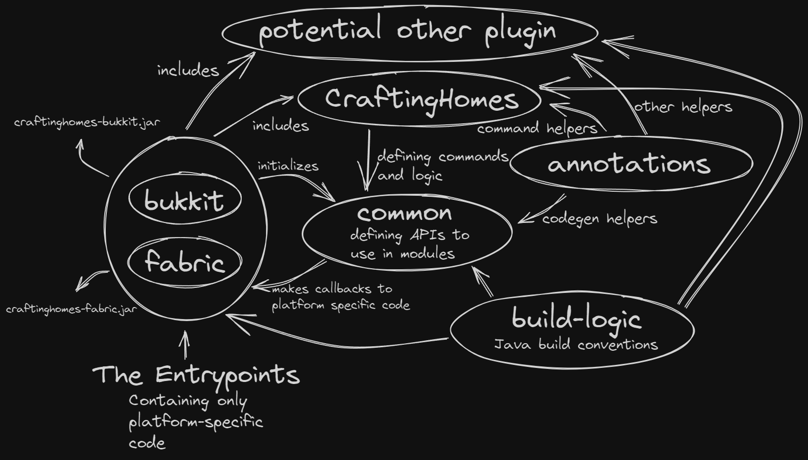

# CraftingHomes

A simple Home plugin.

By itself, this is supposed to be a simple Home 
plugin (for now) that has the basic commands `/home`, `/homes`,
`/sethome`, `/delhome` and 3 Homes per player.

## Versions

| Platform                     | Version(s)   | Dependencies                                                                 | Optional Dependencies                       |
|------------------------------|--------------|------------------------------------------------------------------------------|---------------------------------------------|
| Bukkit (Spigot, Paper, etc.) | 1.8.8-1.20.2 | none                                                                         | none                                        |
| Fabric                       | 1.20.1       | [sgui  1.2.2+1.20](https://github.com/Patbox/sgui/releases/tag/1.2.2%2B1.20) | [LuckPerms](https://luckperms.net/download) |

Platform or version missing? Just create an issue.

## Configuration

Several things can be configured in the `config.yml` file.

- maxHomes: The maximum amount of homes a player can have, default: 3
- language: The language to use, default: en
- storage: The storage to use (yml, coming soon..), default: yml

You can add your own language by creating a new file your_language.lang.yml

## Permissions

If there is no permission provider (Fabric without LuckPerms), op (level 3) is the default permission for admin 
commands and no permission for normal commands.

| Permission Node           | Description                              | Default Value |
|---------------------------|------------------------------------------|---------------|
| craftinghomes.*           | All CraftingHomes permissions            | op            |
| craftinghomes.home        | Access to /home [home] command           | true          |
| craftinghomes.sethome     | Access to /sethome [home] command        | true          |
| craftinghomes.delhome     | Access to /delhome [home] command        | true          |
| craftinghomes.bypass      | Allows bypassing the maxHomes limit      | op            |
| craftinghomes.homes.*     | Access to all /homes commands            | op            |
| craftinghomes.homes.use   | Access to /homes command                 | true          |
| craftinghomes.homes.other | Access to /homes <player> [home] command | op            |

## Technical insight

I know that I over-complicated many things, but this is a kind of exercise for me.
You may look at the `craftinghomes` subproject that contains the whole logic. 
Everything else is just there to make it work.

## Roadmap
- [x] Persistent Data Storage
- [x] Configurable Homes per player
- [x] reflection for command discovery
- [x] abstract command definition syntax (with annotations)
- [x] configurable i18n
- [x] reflection to discover and set command arguments
- [x] gui for /homes
- [x] /homes <player> for admins with permission
- [x] /homes <player> <home> for admins with permission
- [x] data storage templating
- [x] fabric implementation
- [ ] other implementations like forge
- [ ] more ci tests (like smells or code coverage)
- [x] unit tests
- [ ] more data storage providers (mysql, sqlite, mongodb)
